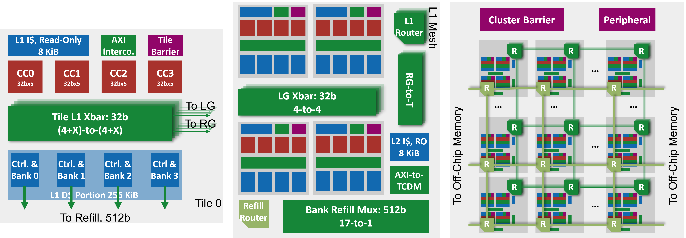

# CachePool

> ⚠️ This repository is under active development. Interfaces and build flows may change.

## Overview

CachePool is a Snitch–Spatz–based many-core system with a shared L1 data cache ("CachePool") and DRAMSys-backed main memory. Configuration is centralized in `config/config.mk` and propagated automatically to:
- SystemVerilog (via `VLOG_DEFS` at compile time)
- The Spatz cluster generator (via an auto-generated `config/cachepool.hjson`)



## System Hierarchy

| Level | Module | Description |
|-------|--------|-------------|
| 1 | Core Complex (CC) | One 32-bit Snitch + one Spatz RVV accelerator |
| 2 | Tile | 4 CCs + 4 × InSitu-Cache banks |
| 3 | Group | 4 Tiles connected via crossbar + shared L2 ICache |
| 4 | Cluster | Multiple Groups connected via a FlooNoC XY mesh (L1 request/response) plus a separate TCDM-based L2 refill mesh |

All tiles across all groups share one unified L1 data cache, interleaved across cache banks. The bank-selection offset is configurable at runtime via `l1d_xbar_config(...)`.

For `NumGroups > 1`, two independent FlooNoC-based meshes connect the groups:
- **L1 group mesh** (`cachepool_group_noc_wrapper.sv`): XY-routed mesh of `floo_router` instances carrying inter-group cache-line requests/responses between tiles.
- **L2 refill mesh** (`cachepool_cluster.sv`, `gen_l2_refill_mesh`): a separate torus-like mesh (distinct flit/header types) that routes DRAM refill traffic from each group to `floo_tcdm_chimney` edge nodes, which bridge into the DRAMSys/HBM channels.

Single-group configurations bypass both meshes; the intra-group crossbar path is unchanged.

## Requirements

- Linux environment with: `make`, `git`, `python3`, `curl`
- **CMake ≥ 3.28**, **GCC/G++ ≥ 11.2**
- **QuestaSim** (tested with `questa-2023.4`)
- Optional: SpyGlass for lint

## Quick Start

### Build Toolchains

This repository uses **Bender** to manage dependencies and generate simulation scripts. Ensure Bender is installed, or build it locally:

```bash
make bender
```

Build the RISC-V toolchains (LLVM + GCC). Spike (`riscv-isa-sim`) is also available through a dedicated target:

```bash
make toolchain
```

For ETH users, a **pre-built toolchain** is available for faster setup. Source `iis-env.sh`
to point the toolchain at it and set up the Python venv needed for RTL/config generation:

```bash
# ETH only: point at a prebuilt toolchain and set up the venv
source iis-env.sh
```

### Initialize Submodules

Use Bender to initialize all required submodules:

```bash
make init
```

### Build DRAMSys

DRAMSys must be compiled before simulation. Tool versions can be overridden inline:

```bash
make dram-build CMAKE=/path/to/cmake-3.28.x CC=/path/to/gcc-11.2 CXX=/path/to/g++-11.2
```

### Generate Required RTL

Some RTL components (e.g., package headers) must be generated prior to simulation.
Generation requires specifying a **configuration**. If none is provided, the default is `cachepool_fpu_4g`.

```bash
make generate config=cachepool_fpu_4g
```

`make generate` now also regenerates the FlooNoC package (`update-floonoc`) as a prerequisite, so the correct mesh topology for the selected `config` is always built automatically. Run `make update-floonoc config=<name>` standalone if you only need to refresh the NoC package (e.g. after editing a `config/floonoc_*.yml` topology file).

### Build the BootROM

The BootROM is built separately from the RTL generation step:

```bash
make bootrom config=cachepool_fpu_4g
```

### Compilation and Simulation

Hardware and software builds are decoupled: `make sw` builds software only, `make vsim` builds hardware only. Build whichever you need (or both) independently.

#### Build Software Only

```bash
make sw config=cachepool_fpu_4g
```

#### Build Hardware Only (QuestaSim)

```bash
make vsim config=cachepool_fpu_4g
```

Set `DEBUG=0` to disable `+acc` waveform visibility and speed up simulation (used by CI); default is `DEBUG=1`.

`make hw` is a shortcut for `generate bootrom vsim`; `make all` is a shortcut for `hw sw` (build everything).

#### Run the Simulation

The wrapper script launches the simulation (GUI or CLI) and expects a software ELF path as argument:

```bash
# GUI mode
./sim/bin/cachepool_cluster.vsim.gui  ./software/build/TESTNAME

# Headless mode
./sim/bin/cachepool_cluster.vsim      ./software/build/TESTNAME
```

## Benchmark

A lightweight benchmarking automation flow is provided under `util/auto-benchmark` to simplify batch testing of multiple configurations and kernels.

### Files

| File | Description |
|------|-------------|
| `configs.sh` | Defines configurations (`CONFIGS`) and kernel suffixes (`KERNELS`) to test, along with optional `PREFIX` and `ROOT_PATH`. |
| `run_all.sh` | Builds each configuration with `DEBUG=0`, runs all kernels, saves logs, generates summaries, and runs `check-ci.py` on the results. |
| `write_results.py` | Extracts `[UART]` lines from simulator logs and appends them to per-configuration summary files. |
| `check-ci.py` | Scans a simulation log for failures and exits non-zero if any are found (see [CI Checking](#ci-checking)). |

### Usage

1. Edit `configs.sh` to list the desired configurations and kernels:

       CONFIGS="cachepool_fpu_4g cachepool_fpu_16g"
       KERNELS="fdotp-32b_M32768 ffft-64b_M16384 fmatmul-64b_M2048"
       PREFIX="test-"
       ROOT_PATH=../..

2. Run all builds and simulations:

       ./run_all.sh

3. Results will appear in:

       logs/<timestamp>/

   and a symlink:

       logs/latest -> logs/<timestamp>/

### Output Structure

Example directory after a run:

    logs/20251028-1230/
    ├── cachepool_fpu_4g_fdotp-32b_M32768.log
    ├── cachepool_fpu_4g_fdotp-32b_M32768_pm/
    ├── cachepool_fpu_4g_summary.txt
    ├── cachepool_fpu_16g_summary.txt
    └── ...

Each run includes:
- `*.log` — Full simulation output
- `*_pm/` — Performance monitor logs automatically moved from `sim/bin/logs` and renamed to `<config>_<kernel>_pm/`
- `*_summary.txt` — `[UART]` summaries for each configuration, grouped by kernel with clear headers

This setup allows quick reproducible benchmarks with all results neatly organized per run.

### CI Checking

`check-ci.py` scans a simulation log and exits non-zero if any failure is detected, making it suitable for integration into CI pipelines. It flags the following patterns:

- Any line containing `FAIL` or `[FAIL]` (case-insensitive)
- Any line matching `error <N>` where N is non-zero (`error 0` is treated as pass)

Usage:

```bash
python3 check-ci.py logs/latest/cachepool_fpu_4g_load-store.log
```

Exit code 0 means all tests passed; exit code 1 means at least one failure was detected. On failure the offending lines and their line numbers are printed for manual inspection.

GitLab CI (`.gitlab-ci.yml`) uses this same flow directly: a `build` stage runs `make clean generate update-floonoc bootrom vsim sw config=$CI_CONFIG DEBUG=0` (default `CI_CONFIG=cachepool_fpu_4g`), then a `test` stage runs each kernel in parallel and pipes its log through `check-ci.py`.

## Configurations

All hardware knobs live in **`config/config.mk`** (and flavor files it includes). The default configuration is **`cachepool_fpu_4g`: 4 groups (2×2 mesh), 4 tiles/group, 4 cores/tile = 64 cores total**. 2-group configurations have been removed — they are no longer compatible with the L2 mesh interconnect.

Configuration names encode the number of groups and whether the FPU is enabled:

| Name | Groups | Mesh | FPU | Tiles/group | Cores/tile | Cores |
|------|--------|------|-----|-------------|------------|-------|
| `cachepool_4g` | 4 | 2×2 | No | 4 | 4 | 64 |
| `cachepool_fpu_4g` | 4 | 2×2 | Yes | 4 | 4 | 64 |
| `cachepool_fpu_16g` | 16 | 4×4 | Yes | 4 | 4 | 256 |
| `cachepool_fpu_16g_tiny` | 16 | 4×4 | Yes | 2 | 2 | 64 |
| `cachepool_dual_4g` | 4 | 2×2 | No (IPU only) | 4 | 4 | 64 CCs / 128 harts |
| `cachepool_dual_fpu_4g` | 4 | 2×2 | Yes | 4 | 4 | 64 CCs / 128 harts |

`cachepool_fpu_16g_tiny` shrinks tiles/group and cores/tile for a faster-to-build, faster-to-simulate smoke test of the full 16-group mesh topology.

`cachepool_dual_4g`/`cachepool_dual_fpu_4g` set `num_scalar_per_core=2`: each Core Complex holds 2 Snitch scalar harts sharing 1 Spatz unit via a hardware ownership lock (`cachepool_spatz_lock.sv`), so "Cores" (Core Complex slots) and hart count diverge — 64 CCs, 128 harts total. `cachepool_dual_fpu_4g` is otherwise identical to `cachepool_fpu_4g` (same FPU/IPU counts), just with the shared-Spatz CC flavor — used to confirm the dual-scalar lock/mux design also works with the FPU enabled, not just IPU-only. The lock never blocks a core's pipeline: every acquire/release attempt (`software/snRuntime/include/spatz_lock.h`) completes immediately with an outcome (granted / denied / granted-but-still-draining), so a hart contending for a lock it doesn't get can always retry or do something else instead of hanging. See `note.md` for the full state-machine design.

The Spatz cluster consumes **`config/cachepool.hjson`**, which is **generated** from:
- `config/cachepool.hjson.tmpl` (skeleton with comments)
- `config/config.mk` (source of truth)

Multi-group configurations also require a FlooNoC topology file (e.g. `config/floonoc_cachepool_4g.yml`, `config/floonoc_cachepool_16g.yml`, `config/floonoc_cachepool_16g_tiny.yml`), auto-selected by the config name suffix. `make generate` regenerates the FlooNoC package automatically; run `make update-floonoc` standalone only if you need to refresh it without a full generate.

To switch configurations, always clean first:

```bash
make clean
make generate config=cachepool_fpu_4g
```

### How configuration flows

1. **`config/config.mk`** defines all parameters (e.g., `num_groups`, `num_groups_x`, `num_tiles_per_group`, `num_cores_per_tile`, `l1d_cacheline_width`, `axi_user_width`, etc.). Derived values are pre-computed so tools receive integers, not expressions.
2. `make generate` calls the Python generator to produce **`config/cachepool.hjson`** from the template.
3. The Makefile passes the same values to **QuestaSim** via `VLOG_DEFS`, keeping RTL, sim, and HJSON in sync.

## Address Scrambling (overview)

- **DRAMSys**: multi-channel main memory with compile-time interleaving. The interleave granularity (bytes) is determined by the DRAM beat width and an `Interleave` factor in RTL. This is fixed at elaboration and not configurable at runtime.
- **L1D cache banking**: runtime-configurable crossbar bit selection allows distributing core traffic across banks for parallelism. Use `l1d_xbar_config(...)` at runtime to choose the offset.

## Cache Bank Partitioning

L1 cache banks can be partitioned at runtime between a **shared pool** (accessible cluster-wide via the interconnect) and a **private partition** (local to each tile). Five modes are supported:

| Mode | `l1d_part` value | Private banks | Shared banks |
|------|-----------------|---------------|--------------|
| All-shared | 0 | none | all |
| 1 private, 3 shared | 1 | 1 | 3 |
| Half-half | 2 | 2 | 2 |
| 3 private, 1 shared | 3 | 3 | 1 |
| All-private | 4 | all | none |

Private banks are local to each tile and not visible to remote tiles. Shared banks participate in the cluster-wide interleaved pool. For non-power-of-2 partition sizes (1 or 3 banks), bank selection uses modulo folding, which causes slightly uneven bank utilisation.

Partitioning is controlled via the `l1d_private` memory-mapped register in the cluster peripheral. The interconnect (`tcdm_cache_interco`) uses a runtime-configurable address rotation scheme to present a dense index space to each cache bank regardless of partition mode, preserving full SRAM utilization. The refill unit applies the inverse rotation before issuing misses to the NoC.

### Private/shared address classification

The boundary between private and shared address regions is configurable at runtime via `l1d_addr(...)`:

- Addresses **≥ boundary** are classified as **private**
- Addresses **<  boundary** are classified as **shared**

The default boundary is `0xA000_0000`. This means data in `.pdcp_src` (at `0xA000_0000+`) is private by default, and data in `.data` (at `0x8000_0000+`) is shared by default. The boundary can be raised or lowered at runtime to reclassify data regions without moving them in memory.

> Changing either the partition mode or the boundary address while the cache contains valid data requires a flush first.

## Cache Flushing

Flush instructions are issued through the cluster peripheral and dispatched to cache controllers via a two-level controller:

- **Cluster level** (`cachepool_peripheral`): holds the instruction and a per-tile one-hot tile-select mask. Issues the instruction to all tiles simultaneously and tracks completion at tile granularity.
- **Tile level** (`cachepool_tile`): receives the instruction, determines which of its local cache controllers to activate based on the partition field, and returns a single ready pulse to the cluster controller when all targeted controllers finish.

### Flush instruction encoding

| `insn` value | Operation | Banks targeted | Tile select |
|-------------|-----------|----------------|-------------|
| `2'b00` | Flush private | Private banks only | Per-tile one-hot mask |
| `2'b01` | Flush shared | Shared banks only | All tiles (forced) |
| `2'b10` | Flush all | All banks | All tiles (forced) |
| `2'b11` | Invalidate (init) | All banks | All tiles (forced) |

For `insn != 2'b00`, the peripheral sets the tile-select mask to all-ones for consistency.

### Software API

Cluster-wide entry points (`software/snRuntime/src/l1cache.c`) — each of these must be called by **all** cores; they fence, barrier, have core 0 issue the register write(s), and barrier again before returning, so callers don't need to gate by core ID themselves:

```c
// Flush all banks in all tiles
l1d_cluster_flush();

// Flush private banks in selected tiles (one-hot tile mask, bits 0-63)
l1d_cluster_private_flush(uint64_t tile_mask);

// Flush shared banks in all tiles
l1d_cluster_shared_flush();

// Set the number of private cache banks per tile (0..NumCache)
l1d_part(uint32_t size);

// Set the private/shared address boundary (addr >= boundary is private)
l1d_addr(uint32_t addr);

// Set the crossbar bank-selection bit offset (clamped to >= cacheline width)
l1d_xbar_config(uint32_t offset);
```

Lower-level, single-shot primitives (`l1d_flush()`, `l1d_private_flush()`, `l1d_shared_flush()`, `l1d_commit()`, `l1d_wait()`) exist for building custom sequences but issue only the register write — the caller is responsible for cluster-wide fence/barrier synchronization around them.

`l1d_addr()` has no hardware completion status bit (unlike flush, which polls `L1D_FLUSH_STATUS` via `l1d_wait()`); its peripheral register write is posted over the interconnect, so it bridges the gap with a fixed-cycle delay on core 0 before the final barrier.

> Changing the partition mode, boundary address, or crossbar offset while the cache contains valid data requires a flush first — `l1d_xbar_config()` and `l1d_part()` flush internally; `l1d_addr()` does not (call a cluster flush before it if needed).

### Flush completion

Each tile tracks completion per cache controller using a `cache_flush_q` register (one bit per controller). The tile asserts a one-cycle ready pulse to the cluster controller when all targeted controllers have finished. The cluster controller uses a per-tile lock register to track in-flight flushes; a new instruction cannot be issued until all selected tiles report completion.

Cache accesses from cores and remote tiles are gated (`l1d_busy`) while a flush is in progress, preventing stale hits during the flush window.

## Performance Monitor

A simulation-only monitor (`hardware/tb/cachepool_monitor.sv`), instantiated alongside the DUT in the testbench, tracks per-**session** traffic and performance counters — a session is the interval between toggles of the `SPATZ_STATUS.SPATZ_CLUSTER_PROBE` peripheral bit. Software brackets a region of interest with:

```c
start_kernel();  // opens a new monitoring session
// ... code to profile ...
stop_kernel();   // closes the session and dumps counters to file
```

(call from a single core, e.g. `if (cid == 0) { ... }`; both are declared in `software/tests/include/benchmark.h`).

Each session dumps counter files under `sim/bin/logs/`, split into three subfolders:

| Subfolder | Contents |
|-----------|----------|
| `core/` | Per-core statistics (`monitor_core_g<g>_<t>_c<c>.txt`) |
| `noc/` | Inter-group L1 NoC, L2 refill mesh, and DRAM channel traffic |
| `others/` | Per-tile local/group/remote request locality and congestion |

CI test jobs recreate these subfolders before running (build artifacts exclude `sim/bin/logs/`) and archive the whole `sim/bin/logs/` tree as job artifacts.

### NoC Visualization (Vis4Mesh)

For a spatial, time-scrubbable view of NoC traffic (as opposed to `cachepool_monitor.sv`'s per-session text summaries above), a second simulation-only tap, `hardware/tb/cachepool_noc_profiling.sv`, records cycle-accurate per-router/tile/core state and packet traces to `noc_profiling/*.log`. `util/scripts/noc_profiling_to_vis4mesh.py` converts those logs into a dataset for [Vis4Mesh](https://github.com/DiyouS/vis4mesh) (a fork of [ueqri/vis4mesh](https://github.com/ueqri/vis4mesh) with CachePool-specific fixes), a browser-based NoC traffic visualizer.

1. **Enable the profiler and run a kernel** (default `noc_profiling ?= 1`, so this is on unless you passed `noc_profiling=0`):
   ```sh
   make vsim config=<multi-group config> noc_profiling=1
   ./sim/bin/cachepool_cluster.vsim software/build/CachePoolTests/test-<test>
   ```
   L1 (inter-group cache-access mesh) logs (`router_g*.log`, `tile_g*.log`) only populate with `num_rg_ports_per_core > 0` (a multi-group config); L2 (DRAM-refill mesh) logs (`l2_router_g*.log`) and per-core PE logs (`pe_g*.log`) are always populated.

2. **Convert to a Vis4Mesh dataset**:
   ```sh
   python3 util/scripts/noc_profiling_to_vis4mesh.py --level l1 \
     --num-groups-x <NumGroupsX> --num-groups-y <NumGroupsY> \
     --num-tiles-per-group <NumTilesPerGroup> --num-noc-ports-per-tile <NumNoCPortsPerTile> \
     --output-dir util/vis4mesh/visdata/<name>
   ```
   `--level` selects the network and channel breakdown:
   | Level | Network | Channel breakdown |
   |---|---|---|
   | `l1` (default) | Inter-group cache-access mesh | Per physical link (tile × NoC port) |
   | `l2` | DRAM-refill mesh | Single (per your read/write/resp split via message type) |

   `--num-tiles-per-group`/`--num-noc-ports-per-tile` are only needed for `l1`. See the script's module docstring for the full data-shape/limitation notes (e.g. hop-distance and transfer-type filters aren't populated yet).

3. **Build and serve Vis4Mesh, then upload the dataset directory**:
   ```sh
   make vis4mesh-serve   # clones/builds util/vis4mesh (pinned, see util/vis4mesh.version), serves at http://localhost:8000
   ```
   Open the URL, click the upload button, and select the `--output-dir` directory from step 2.

## Snitch–Spatz Core Complex

The default system uses a 32-bit Snitch core with a Spatz RVV accelerator. Double-precision is disabled by default for scalability; enable the FPU flavor (`cachepool_fpu.mk`) for single/half precision support.

### Dual-scalar flavor (`cachepool_cc_dual.sv`)

Set `num_scalar_per_core=2` (e.g. `cachepool_dual_4g`, see [Configurations](#configurations)) to build a Core Complex with **2 Snitch scalar harts sharing 1 Spatz unit**. Motivating workload: tasks where not every hart needs the vector unit at the same time, and control hands Spatz off between the pair at coarse task boundaries. The two harts get sequential hart/core IDs (e.g. cid 0/1 within a pair); `snrt_cluster_is_primary()` (`snrt.h`) tells a hart whether it's the pair's default owner (even `cid`) or its partner (odd `cid`).

Ownership is arbitrated by `cachepool_spatz_lock.sv`, a small hardware FSM (`Free`/`Locked`/`AcqWait`/`RelWait`) intercepting two dedicated peripheral addresses. It never blocks a core's pipeline: every acquire/release attempt is a plain **load** that always completes immediately, returning an outcome (`FAIL`/`SUCCESS`/`SUCCESS-WAIT`) instead of stalling the hart — so a hart that doesn't get the lock can retry, back off, or do other work instead of hanging. See `software/snRuntime/README.md` for the software API and `note.md` for the full state-machine design.

**Free vs. Locked performance**: while unlocked (`Free` state), `acc_mux.sv` shares Spatz between both harts via real round-robin arbitration, but every loadstore op must fully drain (real memory completion, not just issue-accept) before the next grant is offered — this holds even for a single hart with no contention from its partner, since the mux has no way to know a sequence of ops belongs to an uncontended hart until it tries to arbitrate again. Loadstore-heavy code therefore runs serialized on real memory latency in `Free` mode. Acquiring the lock (`Locked` state) removes this: the owner's issue path bypasses round-robin arbitration entirely and pipelines back-to-back LSU ops at full throughput. A kernel that does sustained vector/FP loadstore work should hold the lock around that section even if its partner hart never contends for Spatz at all.

Two per-role partial-barrier helpers, `snrt_cluster_host0_barrier()`/`snrt_cluster_host1_barrier()` (`snrt.h`), let a kernel synchronize only the pair's default owners (or only their partners) without hand-writing a participant mask; both degrade to an ordinary full barrier on a single-scalar-per-CC build, so kernels using them don't need a config-specific `#if`.

## Stack

Each core complex has a local **stack SPM**. Its depth is configured via parameters in `config/config.mk` (forwarded to RTL). If the stack exceeds the local SPM, it spills into the cache space (indexed with core ID bits).

## Peripherals

Cluster peripherals (including the BootROM and memory-mapped registers) are instantiated at the cluster level, outside of the Spatz cluster. The peripheral register block is defined in `hardware/cachepool_peripheral/` and generated from an HJSON register description.

## Address Map (example)

> Actual values come from `config/config.mk`. Example below reflects the defaults used by the generated HJSON/template.

| Start Address | Size         | Region        | Notes                                |
|---------------|--------------|---------------|--------------------------------------|
| `0x0000_0000` | `0x0000_1000`| Unused        | —                                    |
| `0x0000_1000` | `0x0000_1000`| Boot ROM      | Boot address typically `0x0000_1000` |
| `0x8000_0000` | `0x2000_0000`| DRAM          | 512 MiB (default in template)        |
| `0xA000_0000` | —            | Private boundary | Default `l1d_addr` value; addresses ≥ this are private |
| `0xBFFF_F800` | `0x0000_0200`| Stack (local) | Example stack window                 |
| `0xC000_0000` | `0x2000_0000`| Uncached      | MMIO/peripherals region              |
| `0xC001_0000` | `0x0000_1000`| UART          | UART base inside peripheral window   |

## Lint

SpyGlass lint (optional):

```bash
make lint config=cachepool_fpu_4g
```

---

### Tips

- To see the exact macros passed to vlog, check `VLOG_DEFS` in the Makefile and `sim/work/compile.vsim.tcl`.
- If you change cacheline width, `AXI_USER_WIDTH` is derived (supported widths: 128→19, 256→18, 512→17). Unsupported widths error out at generation time.
- `make generate` regenerates the FlooNoC package automatically; only run `make update-floonoc` standalone if you're iterating on a `config/floonoc_*.yml` topology file without a full generate.
- `make sw` and `make vsim` are decoupled (hw/sw build independently); rebuild whichever side you changed.
- Use `make clean` when switching configs to prevent stale build artifacts; `clean.sw`/`clean.hw` (or their finer-grained parts `clean.data`/`clean.generate`/`clean.vsim`) clean only one side if you don't need a full rebuild.
- Runtime functions `snrt_tile_id()` and `snrt_num_tiles()` are available to query tile topology from software.
- Changing the partition mode or boundary address while the cache holds valid data requires a flush (`l1d_cluster_flush()` or the appropriate cluster-wide partition flush) before reconfiguring.
- Set `DEBUG=0` to disable `+acc` and speed up simulation (used by CI); default is `DEBUG=1` for waveform visibility.

## License

CachePool is released under permissive open source licenses. Most of CachePool's source code is released under the Apache License 2.0 (`Apache-2.0`), see [LICENSE](LICENSE). The code in `hardware/` is released under Solderpad v0.51 (`SHL-0.51`), see [hardware/LICENSE](hardware/LICENSE).
