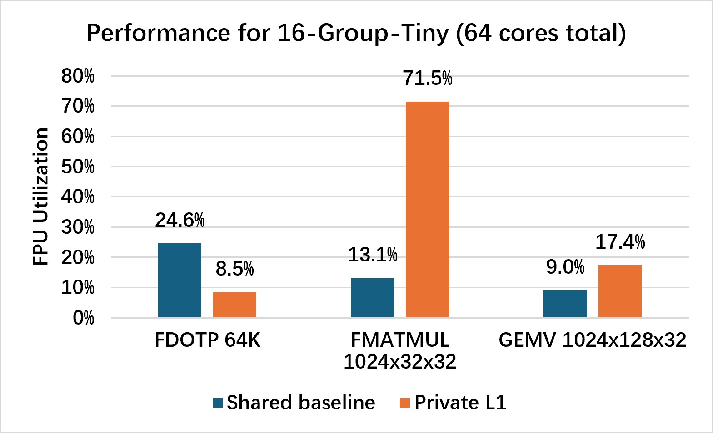
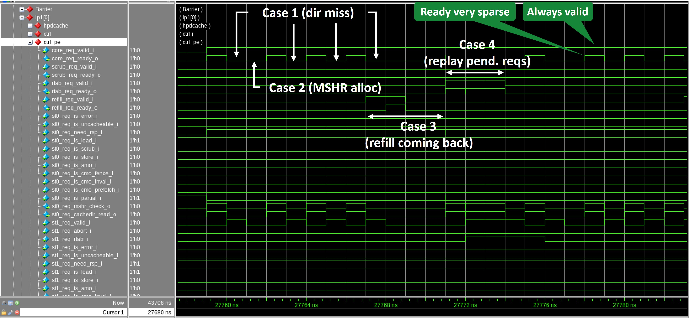

# CachePool — Private-L1 + AMO Work Sign-Off

This note summarises the work done on the `hohung-multi-group` branch: adding a
per-core **private L1 data cache** in front of the existing shared distributed
cache (now the L2), adding **AMO** support through that hierarchy, and the
**runtime + kernel-side software** needed to keep data coherent across cores in
the absence of hardware coherence.

The system stays a Snitch–Spatz many-core; the memory hierarchy is now:

```
Snitch scalar ─┐
               ├─▶ per-core private L1 (HPDcache, write-through) ─▶ shared distributed L2 (InSitu) ─▶ DRAMSys
Spatz lanes ───┘
```

---

## Naming conventions

The **existing shared-cache naming was left
untouched** — modules, signals, and files that referred to the shared
distributed cache as "L1" still say `l1` (e.g. `l1cache.c`, `l1d_*`), even though
that cache now sits *behind* the new private cache.

The new **private** per-core cache is consistently named after **LP1** (`lp1`):
`lp1cache.{c,h}`, `lp1_inval`/`lp1_wt_flush`, the `lp1_cmo_*` peripheral
registers, and the `lp1_*` tests.

The **only exception** is `hardware/src/cachepool_l1_ctrl.sv`, the private-cache
controller. There **"L1" means the private cache** it implements and 
**"L2" means the shared cache** downstream (`l2_req_o`/`l2_rsp_i`).

---

## Note on Bender

Two dependencies in `Bender.yml` currently point at **my fork repos, not
the `pulp-platform` versions**:

- **Insitu-Cache** → `github.com/HHT1228/Insitu-Cache.git` (rev
  `hohung/cachepool/wt-l1`), in place of the commented-out
  `pulp-platform/Insitu-Cache`.
- **hpdcache** → `github.com/HHT1228/cv-hpdcache.git` (rev
  `cachepool/no_coherence`).

Both forks carry changes this work depends on (the coalescer moved into the L1;
the write-through / fine-tuned HPDcache configuration).

---

## Regenerating peripheral registers on a core-count change

The per-core CMO injector has **one register slot per core** (`NumLp1CmoRegs`),
baked into `hardware/cachepool_peripheral/cachepool_peripheral_reg_{pkg,top}.sv`
and `software/snRuntime/include/cachepool_peripheral.h`. **If the core count
changes, regenerate these:**

```bash
make update-periph-reg config=<config>
```

This is crucial for the CMO calls to work. If `NumLp1CmoRegs < num_cores`, any
core with `cid >= NumLp1CmoRegs` has no decoded slot: its `LP1_CMO_STATUS` never
clears, so every `lp1_*` call on that core **spins forever** → cluster-barrier
deadlock.

---

## 1. Hardware implementation

### Private L1 data cache (`hardware/src/cachepool_l1_ctrl.sv`)

A new per-core controller wraps one **HPDcache** (write-through, **no hardware
coherence**) as a private L1. Both Snitch scalar traffic and the Spatz vector
lanes pass through it. The controller:

- **Coalesces the Spatz lanes** into one wide HPDcache request (`sid=0`) via the
  vendored InSitu `par_coalescer`, and translates the single Snitch port into a
  second HPDcache request (`sid=1`). The former per-tile Spatz coalescer/bypass
  stages were removed from the shared cache and **moved into this L1**.
- **Packs all metadata that must survive the HPDcache round-trip into `tid`**,
  and scatters the response back to the originating lanes.
- **Merges** HPDcache's separate mem read/write channels into a single
  downstream TCDM request/response pair (`l2_req_o`/`l2_rsp_i`) that feeds the
  shared L2 through the existing `tcdm_cache_interco`.
- Because L1↔L2 traffic is **cacheline-granular**, the shared L2 controller was
  simplified to a single cacheline-wide core port (`WordWidth = CacheLineWidth`),
  and the tile bank wiring was updated to match.

<!-- **Byte-enable fix (commit `3711453`).** The write byte-strobe path into the wide
cache word was corrected on both paths:
- *Scalar:* the Snitch store strobe was being double-shifted by `addr[1:0]`
  (once by Snitch's reqrsp when forming the strobe, again here), landing every
  sub-word store at 2× its byte offset. Fixed to shift only by the word-slot
  offset `addr[3:2]*LaneBytes`.
- *Vector:* the hand-built `coal_be` used the lane index instead of the
  coalescer's slot index (`ofsts[i]`) and ignored per-lane strobes, so strided /
  indexed stores wrote zeros over live data. Replaced with the coalescer's own
  `coal_req_wmask`, which is consistent with the write data **by construction**.
  This was the root cause of FFT producing an all-zero output. -->

### AMO support (`hardware/src/spatz_cache_amo.sv`, `cachepool_l1_ctrl.sv`)

Atomic memory operations are supported end-to-end through the new hierarchy:

- The L1 controller **maps Spatz/Snitch AMO ops to HPDcache uncacheable AMO ops**
  (`AMOSwap/Add/And/Or/Xor/Max/Min/Maxu/Minu` and `LR/SC`) on the request path,
  and re-derives the RISC-V AMO op from HPDcache's `mem` atomic encoding on the
  L1→L2 path. AMOs are never coalesced and carry the hit lane's op.
- The Snitch AMO path is marked uncacheable at the L1 requester. HPDcache forwards uncacheable reqeust directly to 
  the lower hierarchy without touching its local data.
- `spatz_cache_amo.sv` is the module in front of the shared cache that executes
  the atomics (LR/SC reservations at `DataWidth` granularity).

### Per-core CMO injector (HW side of the software CMO API)

To let software manage coherence explicitly, each core gets a **CMO (Cache
Management Operation) injector** on HPDcache requester port 2, driven by the
cluster peripheral (`hardware/cachepool_peripheral/`):

- A per-core register slot (`cfg_lp1_cmo`, `cfg_lp1_cmo_addr`, `lp1_cmo_commit`,
  `lp1_cmo_status`) issues one CMO and reports completion, so unrelated cores
  never contend on a shared trigger.
- A small FSM (`CMO_IDLE → CMO_REQ → CMO_RESP`) decodes the op and drives the
  HPDcache: `FENCE` (write-through write-buffer drain), `INVAL_ALL` (invalidate
  whole private L1), `INVAL_NLINE` (invalidate one line by address).
- The number of register slots (`NumLp1CmoRegs`) is **derived from the core
  count** (`make update-periph-reg`) so it scales from 2g up to 16g.

---

## 2. Software implementation

Because the private L1 is **write-through with no hardware coherence**, any data
shared between cores needs explicit software coherence at the producer/consumer
boundary. The pattern throughout is:

```
acquire:  lp1_inval()      // drop stale private lines, so reads miss to fresh L2
   ... critical section / consume ...
release:  snrt_fence()     // drain in-flight Snitch + Spatz memory ops
          lp1_wt_flush()   // drain the write-through write buffer down to L2
```

### Runtime CMO primitives (`software/snRuntime/{include,src}/lp1cache.c/.h`)

Thin wrappers over the per-core CMO injector, each acting on the calling core's
own private L1 (no barrier needed — the register slot is per-core):

| Function | Op | Purpose |
|---|---|---|
| `lp1_wt_flush()` | `FENCE` | **Release** — drain write-through write buffer to L2 |
| `lp1_inval()` | `INVAL_ALL` | **Acquire** — invalidate whole private L1 |
| `lp1_inval_line(addr)` | `INVAL_NLINE` | Invalidate the single line covering `addr` |

Each writes op+addr to its slot, pulses `commit`, then spins on `status`.
Note on fences: `snrt_fence()` drains **both** Snitch and Spatz outstanding
memory ops; `snrt_fence_snitch()` / `snrt_fence_spatz()` are the single-engine
variants.

### Kernel data protection

The CMO discipline was applied to the kernels that share data across cores:

- **fdotp-32b** (`software/tests/fdotp-32b/main.c`) — barrier-based partial-sum
  reduction. Producers `snrt_fence()` + `lp1_wt_flush()` their partials; the
  reducing core `lp1_inval()`s before reading, so the reduction sees fresh data.
  No lock — visibility only.
- **fft-32b** (`software/tests/fft-32b/main.c`) — multi-stage butterfly. Each
  phase-1 stage is bracketed with acquire (`lp1_inval` + `lp1_wt_flush`) before
  the compute and release (`snrt_fence` + `lp1_wt_flush`) after, with a cluster
  barrier between stages. The phase-2 interior needs no CMOs (its buffer swaps
  stay within the owning core's L1). The pre-verification path on core 0
  additionally `l1d_flush()`es the shared L2.
- **spin-lock / multi-spin-lock** (`software/tests/{spin-lock,multi-spin-lock}/`)
  — the classic lock case: `lp1_inval()` after acquire drops the stale
  lock-protected line so the read refetches; `lp1_wt_flush()` before release
  publishes the update. Multi-spin-lock (independent locks on different cores) is
  the discriminating test that the per-core slotting works.
- **mcs-lock** (`software/tests/benchmark/mcs_lock.c`) — MCS queue lock protected
  with the same acquire/release brackets around the node enqueue/handoff.
- **gemv** (`software/tests/gemv/main.c`) — producer/consumer protection plus an
  `l1d_cluster_flush()` on the shared L2 around the result exchange.


---

## 3. New tests added

All under `software/tests/<name>/`, registered in `software/tests/CMakeLists.txt`.

### Private-L1 bring-up (tiered)

- **lp1_sanity** — Tier 0 single-core smoke test: proves the system boots and one
  core can drive the private-L1 scalar load/store datapath, reach UART, and
  signal EOC with no coherence and nothing shared.
- **lp1_private** — Tier 1 all-cores-in-parallel test on disjoint, cacheline-
  aligned per-core slices, exercising both the scalar path and the Spatz
  coalescer scatter/gather through the L1 with no address ever shared.
- **lp1_eviction** — capacity/replacement test: each core hammers a working set
  far larger than the L1 (and a conflict set exceeding the ways) to force
  eviction and refill-after-eviction, proving it behaves like a cache, not a
  buffer.
- **lp1_cmo** — single-core liveness gate for the per-core CMO injector datapath
  (runtime MMIO store → peripheral reg → CMO FSM → HPDcache → done/status),
  bracketing each `lp1_*` call with print markers to localise any hang.

### AMO

- **arith_amo** — single-core functional test of every RV32 `amo*.w` arithmetic
  op plus in-cacheline word selection, verified only through L2-authoritative
  paths (the AMO's returned old value, `amoor(addr,0)` as an atomic read).
- **lrsc_amo** — single-core LR/SC test that structurally triggers success and
  failure cases (SC with no LR, double SC) and checks state via the SC return
  code and L2-authoritative reads.

### Cross-core coherence / locks

- **multi-spin-lock** — the *discriminating* staleness gate: each core enters its
  critical section many times so 2nd+ entries would re-read a stale private copy,
  which passes only with the CMOs and fails without them.

---

## 4. Performance overview

Measured on `cachepool_fpu_16g_tiny`, comparing the baseline (no private cache)
against the design with a **4 KB private L1** per core.



The private L1 clearly benefits the memory-intensive **FMATMUL** and **GEMV**
kernels but significantly degrades **FDOTP**:

- **FMATMUL** — the largest win: FPU utilisation rises from **13.1% → 71.5%**.
- **GEMV** — improves from **9.0% → 17.4%**.
- **FDOTP** — utilisation drops significantly.

The private L1 helps when data reuse lets cache hits hide memory latency (FMATMUL,
GEMV). For low-reuse, streaming kernels like FDOTP the frequent L1 misses expose
the HPDcache miss penalty, which outweighs the benefit.

Overall, these results demonstrate that the private L1 cache has strong potential
to improve performance, and further gains are expected once the miss-penalty
behaviour is addressed.

---

## 5. HPDcache miss-penalty analysis

HPDcache is described as a "3-stage non-blocking pipeline," but for the **miss
path** it does not pipeline in the usual sense. It cannot service a new,
non-conflicting request in the same cycle that it does bookkeeping (MSHR
allocation, directory update, refill write) for an earlier request. A single load
miss therefore costs several fully-serialised cycles during which the cache
accepts nothing — the source of the unreasonably high miss cost.

The FDOTP waveform below shows HPDcache acknowledging incoming requests on only
**4 sparse cycles out of 16** (≈25% request-side utilisation). Four cases from the
protocol-engine state machine contribute to this pattern:



- **Case 1 — Directory miss.** On a directory miss for a cacheable load, HPDcache
  unconditionally inserts a bubble and deasserts `ready`, whether or not the MSHR
  hits. No new request is accepted that cycle.
- **Case 2 — MSHR allocation.** The next cycle, MSHR allocation and directory
  update insert another bubble. So one miss already causes at least two
  consecutive blocked cycles before the refill is even processed.
- **Case 3 — Refill return.** When refill data returns, the pipeline is reserved
  for the refill; core requests are blocked throughout, even ones that do not
  conflict with the incoming refill.
- **Case 4 — Pending-request replay.** Requests held in the replay table are
  served once the line is retrieved, go through the same pipeline, and take
  priority over new core requests; `ready` is again gated during this.

As a result, miss detection, MSHR allocation, refill handling, and request replay
are **fully serialised rather than overlapped**. HPDcache is genuinely non-blocking
or "pipelined" only under limited conditions — a cache hit, or a hit while a miss
is already outstanding; the miss-handling stages themselves are effectively
unpipelined. In FDOTP, the flush protection plus the small cache size make this
access pattern repeat throughout execution, producing the very high miss penalty
observed.